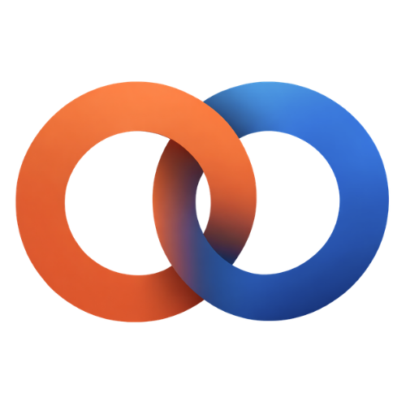

<p align="center">
    
</p>
<p align="center"><h1 align="center">ORDINALY.AI</h1></p>
<p align="center">
    <em>Esta es la página principal de Ordinaly. El software de Ordinaly tiene como misión ayudar a las empresas a agilizar y mejorar sus procesos con ayuda de la IA.</em>
</p>
<p align="center">
<p align="center">Hecho con las tecnologías de:</p>
<p align="center">
    
    
    
    
    <br>
    
    
    
</p>
<br>

## Índice

- [Índice](#índice)
- [Visión general](#visión-general)
- [Estructura del proyecto](#estructura-del-proyecto)
  - [Índice del proyecto](#índice-del-proyecto)
- [Primeros pasos](#primeros-pasos)
  - [Requisitos previos](#requisitos-previos)
  - [Instalación](#instalación)
  - [Uso](#uso)
- [Contribuir](#contribuir)
- [Licencia](#licencia)
- [Reconocimientos](#reconocimientos)

---

## Visión general

🚀 **AUTOMATIZA TU NEGOCIO CON IA**  
Transformamos empresas con automatizaciones inteligentes. Desde chatbots hasta flujos de trabajo avanzados, te ayudamos a modernizar tu empresa y a ser más eficiente.

🤖 **Chatbots Inteligentes**  
Automatiza la atención al cliente 24/7 con IA conversacional avanzada.

🔄 **Workflows Automatizados**  
Integración con Odoo, Slack y herramientas empresariales.

📱 **WhatsApp Business**  
Automatización de ventas y soporte vía WhatsApp Business API.

🌐 **Integración Global**  
Conectamos todos tus sistemas en una plataforma unificada.

📊 **Consultoría Personalizada**  
Análisis y estrategia de automatización adaptada a tu negocio.

⚙️ **Optimización Continua**  
Monitoreo y mejora constante de tus procesos automatizados.

---

## Estructura del proyecto

```sh
└── ordinaly/
    ├── LICENSE
    ├── README.md
    └── frontend
        ├── components.json
        ├── eslint.config.mjs
        ├── next-env.d.ts
        ├── next.config.ts
        ├── node_modules
        ├── package-lock.json
        ├── package.json
        ├── postcss.config.mjs
        ├── public/
        ├── src/
        ├── tailwind.config.ts
        └── tsconfig.json
```


###  Índice del proyecto
<details open>
    <summary><b><code>ORDINALY/</code></b></summary>
        <summary><b>frontend</b></summary>
        <blockquote>
            <table>
            <tr>
                <td><b><a href='/home/amacias/Developer/ordinaly/blob/master/frontend/components.json'>components.json</a></b></td>
                <td><code>Archivo de configuración de componentes personalizados.</code></td>
            </tr>
            <tr>
                <td><b><a href='/home/amacias/Developer/ordinaly/blob/master/frontend/postcss.config.mjs'>postcss.config.mjs</a></b></td>
                <td><code>Configuración para PostCSS, utilizado en el procesamiento de CSS.</code></td>
            </tr>
            <tr>
                <td><b><a href='/home/amacias/Developer/ordinaly/blob/master/frontend/eslint.config.mjs'>eslint.config.mjs</a></b></td>
                <td><code>Configuración de ESLint para mantener la calidad del código.</code></td>
            </tr>
            <tr>
                <td><b><a href='/home/amacias/Developer/ordinaly/blob/master/frontend/tsconfig.json'>tsconfig.json</a></b></td>
                <td><code>Configuración de TypeScript para el proyecto frontend.</code></td>
            </tr>
            <tr>
                <td><b><a href='/home/amacias/Developer/ordinaly/blob/master/frontend/package.json'>package.json</a></b></td>
                <td><code>Gestión de dependencias y scripts del frontend.</code></td>
            </tr>
            <tr>
                <td><b><a href='/home/amacias/Developer/ordinaly/blob/master/frontend/tailwind.config.ts'>tailwind.config.ts</a></b></td>
                <td><code>Configuración de Tailwind CSS para estilos personalizados.</code></td>
            </tr>
            <tr>
                <td><b><a href='/home/amacias/Developer/ordinaly/blob/master/frontend/package-lock.json'>package-lock.json</a></b></td>
                <td><code>Archivo de bloqueo de dependencias generado por npm.</code></td>
            </tr>
            <tr>
                <td><b><a href='/home/amacias/Developer/ordinaly/blob/master/frontend/next.config.ts'>next.config.ts</a></b></td>
                <td><code>Configuración personalizada para Next.js.</code></td>
            </tr>
            </table>
            <details>
                <summary><b>src</b></summary>
                <blockquote>
                    <details>
                        <summary><b>lib</b></summary>
                        <blockquote>
                            <table>
                            <tr>
                                <td><b><a href='/home/amacias/Developer/ordinaly/blob/master/frontend/src/lib/utils.ts'>utils.ts</a></b></td>
                                <td><code>Funciones utilitarias reutilizables en el proyecto.</code></td>
                            </tr>
                            </table>
                        </blockquote>
                    </details>
                    <details>
                        <summary><b>components</b></summary>
                        <blockquote>
                            <table>
                            <tr>
                                <td><b><a href='/home/amacias/Developer/ordinaly/blob/master/frontend/src/components/footer.tsx'>footer.tsx</a></b></td>
                                <td><code>Componente para el pie de página de la aplicación.</code></td>
                            </tr>
                            </table>
                            <details>
                                <summary><b>ui</b></summary>
                                <blockquote>
                                    <table>
                                    <tr>
                                        <td><b><a href='/home/amacias/Developer/ordinaly/blob/master/frontend/src/components/ui/sparkles.tsx'>sparkles.tsx</a></b></td>
                                        <td><code>Efecto visual de destellos para la interfaz de usuario.</code></td>
                                    </tr>
                                    <tr>
                                        <td><b><a href='/home/amacias/Developer/ordinaly/blob/master/frontend/src/components/ui/card.tsx'>card.tsx</a></b></td>
                                        <td><code>Componente de tarjeta reutilizable para mostrar contenido.</code></td>
                                    </tr>
                                    <tr>
                                        <td><b><a href='/home/amacias/Developer/ordinaly/blob/master/frontend/src/components/ui/button.tsx'>button.tsx</a></b></td>
                                        <td><code>Componente de botón personalizado.</code></td>
                                    </tr>
                                    </table>
                                </blockquote>
                            </details>
                            <details>
                                <summary><b>home</b></summary>
                                <blockquote>
                                    <table>
                                    <tr>
                                        <td><b><a href='/home/amacias/Developer/ordinaly/blob/master/frontend/src/components/home/styled-button.tsx'>styled-button.tsx</a></b></td>
                                        <td><code>Botón estilizado para la página de inicio.</code></td>
                                    </tr>
                                    <tr>
                                        <td><b><a href='/home/amacias/Developer/ordinaly/blob/master/frontend/src/components/home/cover.tsx'>cover.tsx</a></b></td>
                                        <td><code>Componente de portada principal de la página de inicio.</code></td>
                                    </tr>
                                    <tr>
                                        <td><b><a href='/home/amacias/Developer/ordinaly/blob/master/frontend/src/components/home/colourful-text.tsx'>colourful-text.tsx</a></b></td>
                                        <td><code>Texto colorido para destacar información en la home.</code></td>
                                    </tr>
                                    </table>
                                </blockquote>
                            </details>
                        </blockquote>
                    </details>
                    <details>
                        <summary><b>app</b></summary>
                        <blockquote>
                            <table>
                            <tr>
                                <td><b><a href='/home/amacias/Developer/ordinaly/blob/master/frontend/src/app/page.tsx'>page.tsx</a></b></td>
                                <td><code>Página principal de la aplicación Next.js.</code></td>
                            </tr>
                            <tr>
                                <td><b><a href='/home/amacias/Developer/ordinaly/blob/master/frontend/src/app/layout.tsx'>layout.tsx</a></b></td>
                                <td><code>Diseño base y estructura global de la app.</code></td>
                            </tr>
                            <tr>
                                <td><b><a href='/home/amacias/Developer/ordinaly/blob/master/frontend/src/app/globals.css'>globals.css</a></b></td>
                                <td><code>Estilos globales de la aplicación.</code></td>
                            </tr>
                            </table>
                        </blockquote>
                    </details>
                </blockquote>
            </details>
            <details>
                <summary><b>public</b></summary>
                <blockquote>
                    <table>
                    <tr>
                        <td><b><a href='/home/amacias/Developer/ordinaly/blob/master/frontend/public/robots.txt'>robots.txt</a></b></td>
                        <td><code>Archivo para controlar el acceso de bots y motores de búsqueda.</code></td>
                    </tr>
                    </table>
                </blockquote>
            </details>
        </blockquote>
    </details>
</details>

---
##  Primeros pasos

###  Requisitos previos

Antes de comenzar con ordinaly, asegúrate de que tu entorno de ejecución cumpla con los siguientes requisitos:

- **Lenguaje de programación:** JavaScript
- **Gestor de paquetes:** Npm


###  Instalación

Instala ordinaly usando uno de los siguientes métodos:

**Compilar desde el código fuente:**

1. Clona el repositorio de ordinaly:
```sh
❯ git clone https://github.com/ordinaly-software/ordinaly.git
```

2. Navega al directorio del proyecto:
```sh
❯ cd ordinaly/frontend
```

3. Instala las dependencias del proyecto:


**Usando `npm`** &nbsp; [](https://www.npmjs.com/)

```sh
❯ npm install
```


###  Uso
Ejecuta ordinaly usando el siguiente comando:
**Usando `npm`** &nbsp; [](https://www.npmjs.com/)

```sh
❯ npm run dev
```


<!-- ---
##  Project Roadmap

- [X] **`Task 1`**: <strike>Implement feature one.</strike>
- [ ] **`Task 2`**: Implement feature two.
- [ ] **`Task 3`**: Implement feature three.

--- -->


##  Contribuir

- **💬 [Únete a las discusiones](https://LOCAL/Developer/ordinaly/discussions)**: Comparte tus ideas, proporciona comentarios o haz preguntas.
- **🐛 [Reportar problemas](https://LOCAL/Developer/ordinaly/issues)**: Envía errores encontrados o registra solicitudes de funciones para el proyecto `ordinaly`.
- **💡 [Enviar solicitudes de extracción](https://LOCAL/Developer/ordinaly/blob/main/CONTRIBUTING.md)**: Revisa las PR abiertas y envía tus propias PR.


<details closed>
<summary>Guías de contribución</summary>


1. **Haz un fork del repositorio**: Comienza haciendo un fork del repositorio del proyecto a tu cuenta de LOCAL.
2. **Clona localmente**: Clona el repositorio forkeado en tu máquina local usando un cliente de git.
   ```sh
   git clone /home/amacias/Developer/ordinaly
   ```
3. **Crea una nueva rama**: Trabaja siempre en una nueva rama, dándole un nombre descriptivo.
   ```sh
   git checkout -b nueva-caracteristica-x
   ```
4. **Realiza tus cambios**: Desarrolla y prueba tus cambios localmente.
5. **Confirma tus cambios**: Realiza el commit con un mensaje claro que describa tus actualizaciones.
   ```sh
   git commit -m 'Implementada la nueva característica x.'
   ```
6. **Envía a LOCAL**: Envía los cambios a tu repositorio forkeado.
   ```sh
   git push origin nueva-caracteristica-x
   ```
7. **Envía una solicitud de extracción**: Crea una PR contra el repositorio del proyecto original. Describe claramente los cambios y sus motivaciones.
8. **Revisión**: Una vez que tu PR sea revisada y aprobada, se fusionará en la rama principal. ¡Felicidades por tu contribución!
</details>

<!-- <details closed>
<summary>Gráfico de contribuidores</summary>
<br>
<p align="left">
   <a href="https://LOCAL{/Developer/ordinaly/}graphs/contributors">
      
   </a>
</p>
</details> -->

---

##  Licencia

Este proyecto está protegido bajo la Licencia [APACHE](https://choosealicense.com/licenses/apache-2.0/). Para más detalles, consulta el archivo [LICENSE](LICENSE).

---

##  Reconocimientos

Este proyecto fue realizado por <a href="https://github.com/antoniommff">Antonio Macías</a>.
  <br>
  Para contacto directo, puedes comunicarte conmigo a través de:
  <a href="https://www.linkedin.com/in/antoniommff/">
    
  </a>
  o
  <a href="mailto:antoniommff@gmail.com">
    
  </a>.
  <br>
  Tómate un momento para visitar mi
  <a href="http://bento.me/antoniommff">Página Personal</a> y explorar mis redes sociales.
