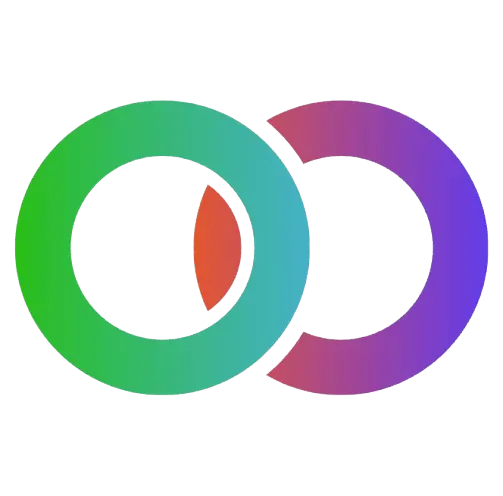

<p align="center">
    
</p>
<p align="center"><h1 align="center">ORDINALY</h1></p>
<p align="center">
    <em>Esta es la página principal de Ordinaly. El software de Ordinaly tiene como misión ayudar a las empresas a agilizar y mejorar sus procesos con ayuda de la IA.</em>
</p>
<p align="center">
<p align="center">Hecho con las tecnologías de:</p>
<p align="center">
    
    
    
    
    <br>
    
    
    
</p>
<br>

## Índice

- [Índice](#índice)
- [Visión general](#visión-general)
- [Estructura del proyecto](#estructura-del-proyecto)
  - [Índice del proyecto](#índice-del-proyecto)
- [Primeros pasos](#primeros-pasos)
  - [Requisitos previos](#requisitos-previos)
  - [Instalación y ejecución](#instalación-y-ejecución)
- [Características principales](#características-principales)
- [Dependencias principales](#dependencias-principales)
  - [Backend (Django)](#backend-django)
  - [Frontend (Next.js)](#frontend-nextjs)
- [Testing](#testing)
  - [Ejecutar tests y obtener cobertura:](#ejecutar-tests-y-obtener-cobertura)
- [Contribuir](#contribuir)
- [Licencia](#licencia)
- [Reconocimientos](#reconocimientos)

---

## Visión general

🚀 **AUTOMATIZA TU NEGOCIO CON IA**  
Transformamos empresas con automatizaciones inteligentes. Desde chatbots hasta flujos de trabajo avanzados, te ayudamos a modernizar tu empresa y a ser más eficiente.

🤖 **Chatbots Inteligentes**  
Automatiza la atención al cliente 24/7 con IA conversacional avanzada.

🔄 **Workflows Automatizados**  
Integración con Odoo, Slack y herramientas empresariales.

📱 **WhatsApp Business**  
Automatización de ventas y soporte vía WhatsApp Business API.

🌐 **Integración Global**  
Conectamos todos tus sistemas en una plataforma unificada.

📊 **Consultoría Personalizada**  
Análisis y estrategia de automatización adaptada a tu negocio.

⚙️ **Optimización Continua**  
Monitoreo y mejora constante de tus procesos automatizados.

---

## Estructura del proyecto

```sh
ordinaly/
├── LICENSE
├── README.md
├── backend/
│   ├── manage.py
│   ├── requirements.txt
│   ├── db.sqlite3
│   ├── config/           # Configuración Django
│   ├── api/              # API REST principal
│   ├── users/            # Gestión de usuarios
│   ├── courses/          # Cursos y formación
│   ├── services/         # Servicios empresariales
│   ├── terms/            # Términos legales
│   └── ...
└── frontend/
    ├── package.json
    ├── public/
    ├── src/
    │   ├── components/
    │   ├── hooks/
    │   ├── i18n/
    │   ├── lib/
    │   └── ...
    ├── messages/         # Archivos de traducción (es, en, ca, eu, gl)
    └── ...
```


###  Índice del proyecto
<details open>
        <summary><b>backend</b></summary>
        <blockquote>
            <b>Apps principales (Django):</b>
            <ul>
                <li><b>api/</b> — API REST principal
                    <ul>
                        <li>models.py, serializers.py, views.py, urls.py, admin.py, tests.py</li>
                        <li>management/commands/ — Comandos personalizados</li>
                    </ul>
                </li>
                <li><b>users/</b> — Gestión de usuarios y autenticación
                    <ul>
                        <li>models.py, serializers.py, views.py, urls.py, admin.py, authentication.py, tests.py</li>
                    </ul>
                </li>
                <li><b>courses/</b> — Cursos y formación
                    <ul>
                        <li>models.py, serializers.py, views.py, urls.py, admin.py, tests.py</li>
                    </ul>
                </li>
                <li><b>services/</b> — Servicios empresariales
                    <ul>
                        <li>models.py, serializers.py, views.py, urls.py, admin.py, tests.py</li>
                    </ul>
                </li>
                <li><b>terms/</b> — Términos legales y documentos
                    <ul>
                        <li>models.py, serializers.py, views.py, urls.py, admin.py, tests.py</li>
                    </ul>
                </li>
                <li><b>config/</b> — Configuración global del proyecto
                    <ul>
                        <li>settings.py, urls.py, wsgi.py, asgi.py, __init__.py</li>
                    </ul>
                </li>
            </ul>
            <b>Otros:</b>
            <ul>
                <li><b>manage.py</b> — Script principal de gestión Django</li>
                <li><b>requirements.txt</b> — Dependencias del backend</li>
                <li><b>media/</b> — Archivos subidos (imágenes, PDFs, etc.)</li>
                <li><b>staticfiles/</b> — Archivos estáticos recolectados</li>
            </ul>
        </blockquote>
    <summary><b><code>ORDINALY/</code></b></summary>
        <summary><b>frontend</b></summary>
        <blockquote>
            <b>Páginas principales (Next.js App Router):</b>
            <ul>
                <li><code>/[locale]/page.tsx</code> — Home</li>
                <li><code>/[locale]/services/page.tsx</code> — Servicios</li>
                <li><code>/[locale]/formation/page.tsx</code> — Cursos y formación</li>
                <li><code>/[locale]/legal/page.tsx</code> — Documentación legal</li>
                <li><code>/[locale]/profile/page.tsx</code> — Perfil de usuario</li>
                <li><code>/[locale]/admin/page.tsx</code> — Panel de administración</li>
                <li><code>/[locale]/auth/signin/page.tsx</code> — Iniciar sesión</li>
                <li><code>/[locale]/auth/signup/page.tsx</code> — Registro</li>
            </ul>
            <b>Componentes principales:</b>
            <ul>
                <li><b>Admin:</b> admin-course-card, admin-course-modal, admin-courses-tab, admin-service-card, admin-service-edit-modal, admin-services-tab, admin-terms-tab, admin-users-tab</li>
                <li><b>Formation:</b> course-card, course-details-modal, add-to-calendar-buttons, bonification-info, enrollment-confirmation-modal, enrollment-cancellation-modal</li>
                <li><b>Home:</b> courses-showcase, demo-modal, pricing-plans, service-showcase, whatsapp-bubble</li>
                <li><b>Services:</b> service-details-modal</li>
                <li><b>UI:</b> admin-tabs, alert, back-to-top-button, badge, button, card, colourful-text, cookies, delete-account-modal, delete-confirmation-modal, dropdown, footer, icon-select, input, label, lazy-image, locale-switcher, logout-modal, markdown-renderer, modal-close-button, modal, navbar, slider, styled-button, textarea</li>
                <li><b>Auth:</b> auth-modal, google-signin-button</li>
            </ul>
            <b>Utilidades y hooks:</b>
            <ul>
                <li>useCourses, useServices, usePreloadResources, useIntersectionObserver</li>
            </ul>
            <b>Internacionalización:</b>
            <ul>
                <li>Archivos de mensajes en <code>/frontend/messages/</code> (es, en, ca, eu, gl)</li>
                <li>Soporte para next-intl y rutas localizadas</li>
            </ul>
        </blockquote>
    </details>
</details>

---
##  Primeros pasos

###  Requisitos previos

Antes de comenzar con Ordinaly, asegúrate de tener instalado:

- **Python 3.10+** y **pip** (para el backend)
- **Node.js 18+** y **npm** (para el frontend)


### Instalación y ejecución

1. Clona el repositorio:
    ```sh
    git clone https://github.com/ordinaly-software/ordinaly.git
    cd ordinaly
    ```

2. Instala dependencias del backend (Django):
    ```sh
    cd backend
    python3 -m venv venv
    source venv/bin/activate
    pip install -r requirements.txt
    # Copia y configura .env proporcionada (DJANGO_SECRET_KEY, GOOGLE_OAUTH2_CLIENT_ID, GOOGLE_OAUTH2_CLIENT_SECRET, y ORDINALY_TEST_PASSWORD)
    # Migraciones iniciales
    python manage.py migrate
    # (Opcional) Crea superusuario
    python manage.py createsuperuser
    # (Opcional) Crea datos de prueba para ver cómo quedaría la web
    python manage.py populate_db
    ````

    [!WARNING]
    NO usar bajo ningún concepto este último comando con la opción `--clear` en el entorno de producción ya que borraría todos los usuarios del sistema.

    ```sh
    # Ejecuta el servidor
    python manage.py runserver
    ```

3. Instala dependencias del frontend (Next.js):
    ```sh
    cd ../frontend
    Copia y configura .env.local proporcionada (se puede encontrar la plantilla en .env.example)
    npm install
    npm run dev
    ```


---

## Características principales

- **Backend Django REST:** API robusta para cursos, usuarios, servicios y términos legales.
- **Frontend Next.js:** UI moderna, responsive, con soporte para dark mode y animaciones.
- **Internacionalización (i18n):** Traducciones completas (es, en, ca, eu, gl) usando next-intl.
- **Gestión de cursos:** Horarios complejos, inscripciones, exportación a calendario (.ics, Google, Outlook).
- **Panel de administración:** Gestión avanzada de usuarios, cursos, servicios y términos.
- **Integración con WhatsApp y Odoo:** Automatización de ventas y flujos empresariales.
- **Accesibilidad y SEO:** Buenas prácticas, sitemap, robots.txt, imágenes optimizadas.


<!-- ---
##  Project Roadmap

- [X] **`Task 1`**: <strike>Implement feature one.</strike>
- [ ] **`Task 2`**: Implement feature two.
- [ ] **`Task 3`**: Implement feature three.

--- -->


##  Dependencias principales

### Backend (Django)
- Django, djangorestframework, django-cors-headers, Pillow, gunicorn, whitenoise, dotenv, markdown, reportlab

### Frontend (Next.js)
- next, react, next-intl, tailwindcss, lucide-react, styled-components, react-markdown, framer-motion, jspdf

---


## Testing

Para asegurar la calidad del backend, es obligatorio mantener al menos un 80% de cobertura de tests.

### Ejecutar tests y obtener cobertura:

```sh
coverage run --source='.' --omit='*/migrations/*,*/tests.py,api/*,config/*,manage.py,*__init__.py' manage.py test
coverage report -m
```

> **Nota:** El proyecto no se considerará válido si la cobertura es inferior al 80%.

---

##  Contribuir

- **💬 [Únete a las discusiones](https://LOCAL/Developer/ordinaly/discussions)**: Comparte tus ideas, proporciona comentarios o haz preguntas.
- **🐛 [Reportar problemas](https://LOCAL/Developer/ordinaly/issues)**: Envía errores encontrados o registra solicitudes de funciones para el proyecto `ordinaly`.
- **💡 [Enviar solicitudes de extracción](https://LOCAL/Developer/ordinaly/blob/main/CONTRIBUTING.md)**: Revisa las PR abiertas y envía tus propias PR.


<details closed>
<summary>Guías de contribución</summary>


1. **Haz un fork del repositorio**: Comienza haciendo un fork del repositorio del proyecto a tu cuenta de LOCAL.
2. **Clona localmente**: Clona el repositorio forkeado en tu máquina local usando un cliente de git.
   ```sh
   git clone /home/amacias/Developer/ordinaly
   ```
3. **Crea una nueva rama**: Trabaja siempre en una nueva rama, dándole un nombre descriptivo.
   ```sh
   git checkout -b nueva-caracteristica-x
   ```
4. **Realiza tus cambios**: Desarrolla y prueba tus cambios localmente.
5. **Confirma tus cambios**: Realiza el commit con un mensaje claro que describa tus actualizaciones.
   ```sh
   git commit -m 'Implementada la nueva característica x.'
   ```
6. **Envía a LOCAL**: Envía los cambios a tu repositorio forkeado.
   ```sh
   git push origin nueva-caracteristica-x
   ```
7. **Envía una solicitud de extracción**: Crea una PR contra el repositorio del proyecto original. Describe claramente los cambios y sus motivaciones.
8. **Revisión**: Una vez que tu PR sea revisada y aprobada, se fusionará en la rama principal. ¡Felicidades por tu contribución!
</details>

<!-- <details closed>
<summary>Gráfico de contribuidores</summary>
<br>
<p align="left">
   <a href="https://LOCAL{/Developer/ordinaly/}graphs/contributors">
      
   </a>
</p>
</details> -->

---

##  Licencia

Este proyecto está protegido bajo la Licencia [APACHE](https://choosealicense.com/licenses/apache-2.0/). Para más detalles, consulta el archivo [LICENSE](LICENSE).

---

##  Reconocimientos

Este proyecto fue realizado por <a href="https://github.com/antoniommff">Antonio Macías</a>.
  <br>
  Para contacto directo, puedes comunicarte conmigo a través de:
  <a href="https://www.linkedin.com/in/antoniommff/">
    
  </a>
  o
  <a href="mailto:antoniommff@gmail.com">
    
  </a>.
  <br>
  Tómate un momento para visitar mi
  <a href="http://bento.me/antoniommff">Página Personal</a> y explorar mis redes sociales.
